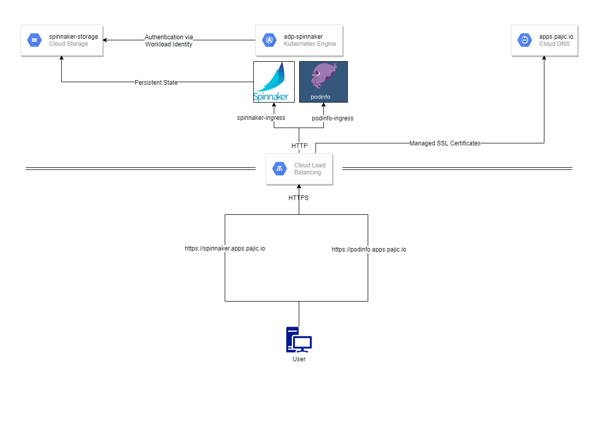
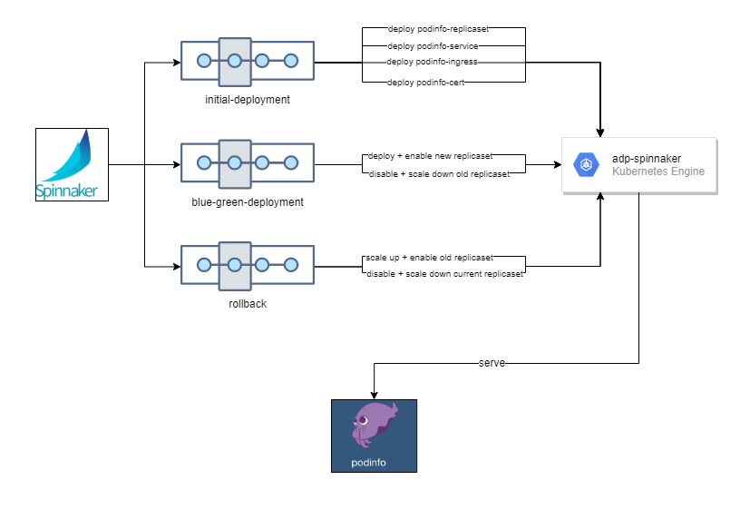

# Spinnaker on GKE (ADP Interview Demo)
A demonstration of a Spinnaker deployment on GKE for showcasing blue-green deployments with rollback functionality inside Spinnaker targeting Kubernetes.

## Quickstart
1. Create a Google Cloud (GCP) account. You should receive 300$ in free trial credits.
2. Create a new project and configure a DNS zone for existing domain (which you own) in Cloud DNS. Make note of the **Project ID**, the **DNS zone name**, and the **DNS domain** itself.
3. Make a note of your **Billing Account ID**.
4. Fork this GitHub repo (jpajic/adp-spinnaker)
5. Create a new **Personal Access Token (PAT)** from your account in GitHub and allow it access to the forked repo
6. Install [Google Cloud SDK](https://cloud.google.com/sdk/docs/install)
7. Open `demo.sh` and replace the variable values with the notes from step 1-5
8. Run `demo.sh`

## Architecture

## Spinnaker Pipelines

## Features
* Spinnaker example application with pipelines from blue-green deployment and rollback
* Resource-efficient by downscaling the inactive environment after successful traffic shift
* GitHub integration via webhooks for automated pipeline execution on changes to manifests in repository
* Custom Domain: apps.pajic.io
* L7 Load balancing via GCP Global Load Balancer
* SSL Termination at GLB (= Global Load Balancer) with certificates provided by GCP Automation
* Secure, low latency traffic routing using Google container-native load balancing
* Seamless authentication from within GKE against other GCP services using Workload Identity
* Fully automated and parametrized via Terraform
* Kubernetes manifests parametrized using Helm and envsubst
* Batteries included - all tools (except Google Cloud SDK) stored in this repository.

## Joys and Pains
See [docs/joys-pains.md](docs/joys-pains.md)

## References
See [docs/references.md](docs/references.md)
